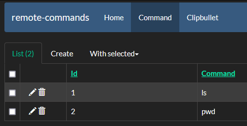

# remote-commands

[](https://www.python.org/)
[](https://flask.palletsprojects.com/en/2.0.x/)


## Descrição

Este app sobe um pequeno servidor Flask na sua máquina, e fica ouvindo por requisições vindas da rede local.

Essas requisições podem ativar algum atalho de teclado na sua máquina, executar algum comando shell previamente cadastrado, ou carregar para o seu clipboard (famoso ctrl+v) algum texto também previamente cadastrado.

Eu utilizo este app em conjunto com o app [HTTP Request Shortcuts](https://play.google.com/store/apps/details?id=ch.rmy.android.http_shortcuts&hl=en_US&gl=US) instalado em um celular velho. A partir dele envio as requests, e o celular funciona como um "controle remoto" que executa comandos no meu PC. Com isso eu economizo alguns alt+TABs e agilizo alguns testes onde preciso rodar o mesmo comando repetidas vezes no shell.

## Dependências

Para que a função **pastebullet** funcione em sistemas linux, é necessário ter o `xclip` instalado:

```
sudo apt-get install xclip
```

## Setup

- Clone o repositório
- Instale as dependência utilizando o `pipenv`
```sh
pipenv install
```
- Inicie o app com o comando
```sh
pipenv run python server/main.py
```
- ou
```sh
./run.sh
```

## Cadastrando comandos e textos para o clipboard

Em seu navegador, acesse `http://localhost:5000/admin` para ir a área de cadastro de **Command** e textos para o clipboard (apelidei de **Clipbullets**).



Cadastre quantos itens quiser.

## Executando

### Executando atalhos

Para executar um atalho, envie uma requisição `POST` com o seguinte body JSON, a partir de qualquer dispositivo de sua rede local para:
- `http://<IP_da_sua_máquina>/shortcut`
```json
{
    "shortcut": "<nome_do_atalho>"
}
```
- Os atalhos disponíveis até o momento são:
    - `minimize_all`: Executa um `winkey + d`, minimizando todas as janelas do windows
    - `mute_unmute_meet`: Executa um `ctrl + d`, o atalho padrão para mutar/desmutar uma chamada no Google Meet

### Executando comandos

Para executar os comandos, envie uma requisição `GET` de qualquer dispositivo de sua rede local para:
- `http://<IP_da_sua_máquina>/command/<id_do_comando>`
  - O `index_do_comando` aqui é o mesmo número que você cadastrou na área de **admin**

### Executando clipbullets

Para carregar os textos cadastrados para o seu clipboard, envie uma requisição `GET` de qualquer dispositivo de sua rede local para:
- `http://<IP_da_sua_máquina>/clipbullet/<id_do_texto>`
  - O `index_do_texto` aqui é o mesmo número que você cadastrou na área de **admin**

Após isso, o texto cadastrado estará no seu `ctrl+v`

## Stack

Este projetinho utiliza os seguintes frameworks e packages para fazer sua magia:
- **flask**: Micro-framework utilizado para fazer o servidor.
- **keyboard**: Lib utilizada para disparar atalhos de teclado na máquina.
- **flask-admin**: Lib que fornece pronta uma área de admin para as Models do app.
- **python-decouple**: Para pegar variáveis de ambiente.
- **peewee**: ORM que manipula o banco (que neste caso é um simples sqlite).
- **wtf-peewee**: Dependência necessária para o flask-admin fazer seus paranauês.
- **clipboard**: Para carregar coisas no famoso ctrl+v da massa.
